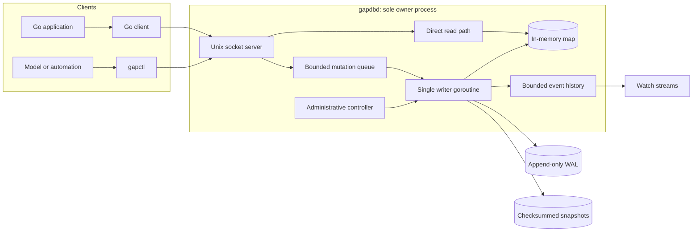
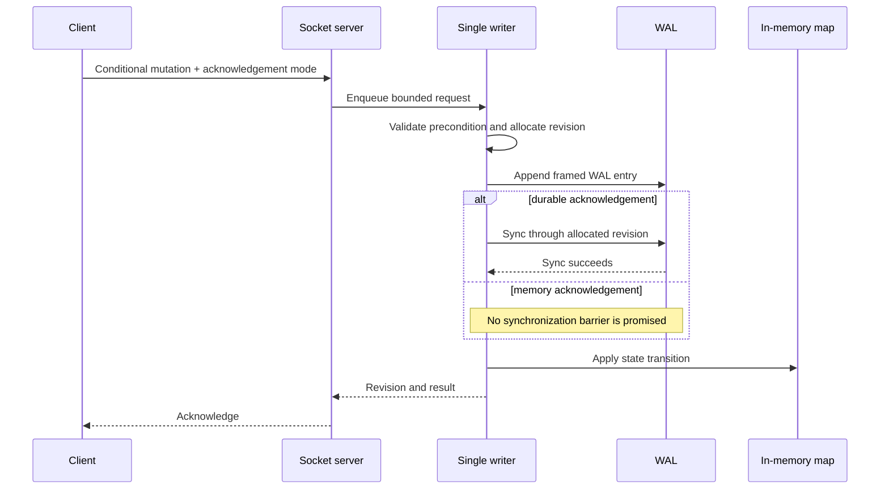
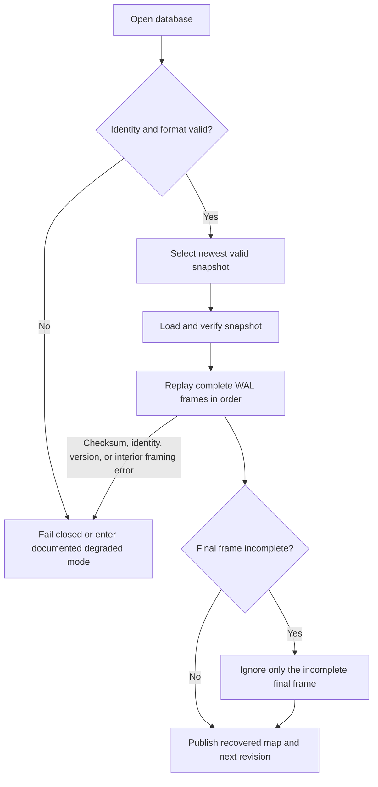

# Gapdb

Gapdb is a small, local coordination database for applications managed by software agents and large language models. It combines an in-memory key-value map, a single serialized writer, conditional mutations, an append-only write-ahead log (WAL), checksummed snapshots, and a Unix-domain socket protocol.

The system is deliberately narrow. It is intended for leases, review state, workflow authority, integration decisions, and other local records whose correctness depends on compare-and-swap semantics and explicit durability. It is not intended to become a general-purpose database.

> **Project status:** Gapdb's MVP implementation and specification are complete. The native conformance suite passes; adoption as a replacement for an existing SQLite backend remains intentionally unapproved until the external adapter comparison and human sign-off are complete.

## Abstract

Local automation often needs more coordination than a process-local map can provide, but substantially less machinery than a client/server database. The essential requirements are usually linearizable conditional updates, crash recovery, explicit acknowledgement semantics, and access from several processes on one host. Conventional embedded databases solve a broader problem and can obscure which operations actually establish authority; distributed systems add costs without addressing a single-host use case.

Gapdb studies a smaller design point: one owner process holds the authoritative map in memory, serves local clients over a Unix socket, and serializes all state transitions through one writer goroutine. Successful commits receive monotonically increasing database-wide revisions. A CRC32C-framed WAL precedes every observable map mutation, while periodic checksummed snapshots bound recovery work. Callers choose between acknowledgements after in-memory application and acknowledgements after durable log synchronization. This exposes the persistence boundary directly instead of implying durability that has not occurred.

## Problem statement

The design question is:

> What is the smallest local state service that can safely arbitrate model-driven workflow authority, recover after process or host failure, and remain operationally legible to both humans and automated agents?

Gapdb answers with four constraints:

1. **One host and one database owner.** There is no consensus protocol, replication layer, or network listener.
2. **One ordered mutation path.** Conditional checks and writes are serialized, making races explicit and testable.
3. **Persistence before publication.** WAL append precedes mutation of the in-memory map; durable acknowledgement additionally requires successful synchronization.
4. **Bounded, inspectable interfaces.** The wire protocol is strict JSON/JSONL with stable error codes, explicit limits, request identifiers, and deterministic administrative output where practical.

## Scope

The core API consists of:

- `Get`
- `Put`
- `PutIfAbsent`
- `CompareAndSwap`
- `DeleteIfRevision`
- `AtomicBatch`
- `ScanPrefix`
- `Watch`

Each record contains a non-empty UTF-8 key, opaque bytes, a database-wide revision, and an optional absolute UTC expiry. Successful operations in an atomic batch share one revision.

Gapdb intentionally has no SQL, joins, secondary indexes, vectors, query planner, cross-host availability, distributed consensus, or general database compatibility layer.

## Architecture



One process acquires an exclusive lock on the database directory and owns its identity, WAL, snapshots, and socket. Reads use an `RWMutex`-protected in-memory map and do not wait behind the writer queue. Mutations, expiry cleanup, snapshot barriers, and state-changing administration pass through the writer goroutine. The default mutation queue is bounded to prevent unbounded memory growth under overload.

The default socket mode is `0600`; the database directory should be `0700`. Gapdb rejects unsafe file ownership and permission conditions rather than silently weakening isolation.

### Commit and acknowledgement protocol



The two acknowledgement modes have intentionally different contracts:

| Mode | Acknowledged after | Intended use |
|---|---|---|
| `memory` | WAL append and in-memory application, without a synchronization promise | Reconstructible or disposable state |
| `durable` | Successful WAL synchronization through the operation's revision and in-memory application | Leases, reviews, workflow decisions, and integration authority |

An abrupt machine failure can lose a successful `memory` write. A failed durable request can be reported as potentially applied when the server cannot prove otherwise; callers must reconcile by reading current state before retrying an authority-bearing operation.

### Recovery



Recovery loads the newest valid checksummed snapshot and replays complete WAL frames in revision order. Only an incomplete final WAL frame is treated as a crash tail. Checksum failures, interior corruption, identity mismatches, or unsupported format versions are not guessed around. Revision gaps caused by allocated-but-failed commits may remain; preserving them is safer than reusing an authority token.

Snapshots and compaction use atomic publication and synchronized parent directories. Offline inspection and recovery are separated into propose/apply steps so automated operators can review an exact repair before changing persistent state.

## Semantics and correctness properties

- **Conditional authority:** `PutIfAbsent`, `CompareAndSwap`, and `DeleteIfRevision` evaluate against the serialized pre-state. A stale caller cannot overwrite a newer decision merely because it writes last.
- **Revision order:** successful commits receive monotonically increasing database-wide `uint64` revisions. A batch is all-or-nothing and has one revision.
- **Read behavior:** a concurrent `Get` observes either the state before or after a committed transition; it never observes a partially applied batch.
- **Expiry:** a record is logically absent at or after its expiry. Physical removal is itself a serialized state transition.
- **Scanning:** prefix scans are sorted and bounded. Pagination is tied to an observed revision; stale continuation requests are rejected.
- **Watching:** a watcher requests events strictly after a revision, receives bounded replay followed by live events, and is failed explicitly if compaction or consumer lag makes continuity impossible.
- **Crash safety:** a mutation is appended to the WAL before it becomes visible in the map. Durable success requires a completed synchronization barrier.
- **Single ownership:** database locking and identity checks prevent two owner processes from independently mutating one directory.

These properties target single-host linearizability and recoverability. They do not constitute distributed linearizability or high availability.

## Architectural decisions

### In-memory authoritative state

Serving reads from a Go map keeps the common path small and predictable. Persistence structures exist for recovery, not as a second query engine. This trades dataset scale for low conceptual and operational overhead; the live dataset must fit in memory.

### A single writer goroutine

Serialization turns condition evaluation, revision assignment, WAL ordering, and publication into one ordered protocol. It avoids fine-grained write locking and makes the correctness argument inspectable. Read concurrency is retained because reads bypass the mutation queue.

### WAL plus snapshots

An append-only WAL makes commit order explicit and supports durable barriers. Checksummed snapshots reduce restart time and allow old WAL history to be compacted. Both formats carry database identity and version information to prevent accidental cross-database replay.

### First-class revisions and CAS

Coordination state is valuable because it answers “who has authority now?” A revision is therefore part of the public record rather than an internal implementation counter. Conditional deletion and replacement allow clients to release or transfer authority only when the state they observed is still current.

### Explicit durability modes

Many local stores conflate “accepted by the process” with “stable after power loss.” Gapdb names both outcomes. The faster mode is useful, but authority-bearing callers must select `durable` deliberately.

### Unix-domain socket transport

The service is local by definition. A Unix socket provides filesystem-mediated access control, avoids opening a TCP attack surface, and gives Go and command-line clients the same owner process and consistency model.

### Model-oriented operations

Gapdb assumes that a large model may administer the application. Interfaces therefore favor bounded schemas, stable machine-readable errors, discoverable limits, non-interactive commands, safe recovery proposals, and request IDs over heuristic or prose-only behavior. `gapctl help`, `schema`, `limits`, `status`, `health`, `stats`, and `describe-config` are designed to let an agent establish context before acting.

## Platform and requirements

Gapdb currently targets **Linux/amd64** and uses Linux filesystem primitives for locking, descriptor-relative operations, and atomic publication. It is not presently portable to macOS or Windows.

To build from source, install:

- Linux
- Go 1.26.7, or a Go installation capable of automatically selecting the toolchain declared in `go.mod`
- Git

No C compiler is required for the normal build.

## Build from source

```bash
git clone https://github.com/spec-kitty/gapdb.git
cd gapdb
go mod verify
go test ./...
mkdir -p bin
CGO_ENABLED=0 go build -trimpath -o bin/gapdbd ./cmd/gapdbd
CGO_ENABLED=0 go build -trimpath -o bin/gapctl ./cmd/gapctl
./bin/gapctl help --text
```

The two binaries are:

- `gapdbd`: database owner and Unix socket server
- `gapctl`: client, inspection, maintenance, and recovery CLI

## Install with Go

```bash
go install github.com/spec-kitty/gapdb/cmd/gapdbd@latest
go install github.com/spec-kitty/gapdb/cmd/gapctl@latest
```

Go installs binaries into `GOBIN`, or into the Go bin directory reported by `go env GOPATH` when `GOBIN` is unset. Add that directory to your executable search path if necessary.

## Quick start

Start the owner in one terminal:

```bash
DB_DIR=/tmp/gapdb-demo
install -d -m 0700 "$DB_DIR"
gapdbd --db "$DB_DIR" --json
```

Use it from another terminal. Global `gapctl` flags precede the command:

```bash
SOCKET=/tmp/gapdb-demo/gapdb.sock

gapctl --socket "$SOCKET" status
gapctl --socket "$SOCKET" put \
  --key demo \
  --value-base64 aGVsbG8= \
  --ack durable
gapctl --socket "$SOCKET" get --key demo
```

The stored value above is the opaque byte sequence `hello`, encoded as canonical padded Base64. Mutation commands accept exactly one of `--value-base64`, `--value-file`, or `--value-stdin`.

### Conditional operations

```bash
gapctl --socket "$SOCKET" put-if-absent \
  --key leases/worker \
  --value-base64 b3duZXItMQ== \
  --ack durable

gapctl --socket "$SOCKET" compare-and-swap \
  --key demo \
  --expected-revision 1 \
  --value-base64 d29ybGQ= \
  --ack durable

gapctl --socket "$SOCKET" delete-if-revision \
  --key demo \
  --expected-revision 2 \
  --ack durable
```

Use revisions returned by the server; the literal revisions in this example assume a fresh database and the shown operation order.

### Scans and watches

```bash
gapctl --socket "$SOCKET" scan-prefix --prefix leases/ --limit 100
gapctl --socket "$SOCKET" --output=jsonl \
  watch --prefix leases/ --after-revision 0
```

JSON is the default bounded output format. JSONL is reserved for streaming watch output.

Run `gapctl help --text` for a concise command index, or use the machine-readable discovery commands:

```bash
gapctl help
gapctl schema
gapctl limits
```

## Go client

```go
package main

import (
	"context"
	"fmt"
	"log"
	"time"

	gap "github.com/spec-kitty/gapdb/gapdb"
)

func main() {
	client, err := gap.Dial(
		"/tmp/gapdb-demo/gapdb.sock",
		gap.ClientOptions{Timeout: 5 * time.Second},
	)
	if err != nil {
		log.Fatal(err)
	}
	defer client.Close()

	ctx, cancel := context.WithTimeout(context.Background(), 5*time.Second)
	defer cancel()

	record, err := client.Put(ctx, "reviews/current", []byte("approved"), nil, gap.AckDurable)
	if err != nil {
		log.Fatal(err)
	}

	loaded, err := client.Get(ctx, "reviews/current")
	if err != nil {
		log.Fatal(err)
	}
	fmt.Printf("revision=%d value=%s\n", record.Revision, loaded.Value)
}
```

The package also exposes `PutIfAbsent`, `CompareAndSwap`, `DeleteIfRevision`, `AtomicBatch`, `ScanPrefix`, and `Watch`.

## Operation and recovery

Normal online administration is available through:

- `status`, `health`, `stats`, and `describe-config`
- `verify`
- `create-snapshot` and `compact`
- `backup`

Offline inspection and recovery commands use `--db` rather than `--socket` and should normally run while the owner is stopped:

```bash
gapctl --db /tmp/gapdb-demo inspect
gapctl --db /tmp/gapdb-demo verify
gapctl --db /tmp/gapdb-demo recover propose
```

Recovery application is a separate, guarded action. Read the proposal and command schema before running `recover apply`. State-changing administrative requests require the expected database identity and revision, preventing an operator or model from applying a stale plan to a changed database.

## Evaluation

The committed reference benchmark uses an AMD Ryzen 5 5600X, local NVMe-backed ext4, Linux/amd64, Go 1.26.7, 100,000 live 1 KiB records, eight readers, one writer, the Unix socket transport, and operating-system `fsync`:

| Operation | p95 | Acceptance target |
|---|---:|---:|
| `Get` | 0.779 ms | ≤ 2 ms |
| Memory-acknowledged `Put` | 0.609 ms | ≤ 5 ms |
| Durable `Put` | 3.072 ms | ≤ 50 ms |
| Snapshot plus 10,000-entry WAL recovery | 522.302 ms | ≤ 5,000 ms |

The evidence also records successful durable-barrier synchronization, 1,024 deterministic crash schedules over 78 hook pairs, race-detector coverage, five fuzz targets, and a portable-adapter conformance suite. These results characterize the reference environment; they are not universal latency guarantees.

Reproduce the normal verification suite with:

```bash
go test ./... -count=1
go test -race ./... -count=1
go vet ./...
staticcheck ./...
govulncheck ./...
```

Benchmark and crash-campaign evidence is retained under [`docs/evidence/`](docs/evidence/).

## Adoption boundary

Gapdb has passed its native portable-adapter scenarios. It has **not** yet been approved to replace the comparison project's SQLite backend. That decision requires equivalent external-adapter evidence and a signed human adoption record. Until then, SQLite remains the production backend. This boundary is intentional: implementation completion is not evidence that migration risk has been accepted.

## Repository guide

- [`docs/formats/protocol-v1.md`](docs/formats/protocol-v1.md) — versioned wire protocol
- [`docs/formats/storage-v1.md`](docs/formats/storage-v1.md) — persistent format and recovery contract
- [`docs/operations/configuration.md`](docs/operations/configuration.md) — configuration and deployment controls
- [`docs/operations/recovery.md`](docs/operations/recovery.md) — inspection and recovery procedures
- [`docs/evidence/`](docs/evidence/) — crash, dependency, performance, and adoption evidence
- [`kitty-specs/gapdb-mvp-01M0Q8K6/spec.md`](kitty-specs/gapdb-mvp-01M0Q8K6/spec.md) — normative product specification
- [`kitty-specs/gapdb-mvp-01M0Q8K6/plan.md`](kitty-specs/gapdb-mvp-01M0Q8K6/plan.md) — architecture and implementation plan
- [`kitty-specs/gapdb-mvp-01M0Q8K6/mission-review-report.md`](kitty-specs/gapdb-mvp-01M0Q8K6/mission-review-report.md) — post-implementation fidelity review
- [`kitty-specs/gapdb-mvp-01M0Q8K6/spec-kitty-workarounds.md`](kitty-specs/gapdb-mvp-01M0Q8K6/spec-kitty-workarounds.md) — workflow-tool issues encountered during development

## License

Gapdb is released under the [MIT License](LICENSE).
