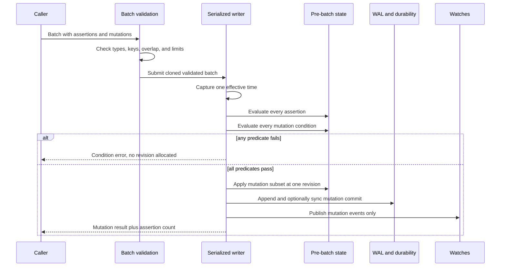

# Implementation Plan: Atomic Batch Read Assertions

**Branch:** `feat/atomic-batch-assertions`  
**Date:** 2026-09-04  
**Spec:** [spec.md](spec.md)  
**Input:** First-class no-write predicates for GapDB atomic batches

## Summary

Extend the existing `gapdb.Batch` contract with bounded `Assertion` values that check revision or absence without mutating the asserted key. The serialized writer evaluates assertions and mutation conditions against one pre-batch logical view. Only the existing mutation subset is written to memory, WAL, snapshots, expiry indexes, and watch history. The Unix protocol gains additive assertion request data and an `assertion_count` result field without changing schema version 1 or breaking assertion-free clients.

The implementation follows the current data path rather than adding a parallel transaction subsystem:

```text
public Batch.ValidateAt
        |
        v
engine.prepareAndSubmit --> serialized writer --> predicate phase --> mutation phase
        ^                                      | failure: no commit
        |                                      ` success: existing commit path
Unix decode/validate --> server handler
        ^
        |
     Go client
```

## Technical Context

**Language/Version:** Go 1.24.6 (the repository toolchain)  
**Primary Dependencies:** Go standard library and existing GapDB packages; no new runtime dependency  
**Storage:** In-memory authoritative map with optional append-only WAL and snapshots  
**Testing:** Go unit/contract/integration tests, subprocess crash harness, race detector, benchmarks, adoption scenarios, mutant controls  
**Target Platform:** Local Unix-like hosts using the in-process API or owner-only Unix socket  
**Project Type:** Single Go module with public client/model package and internal engine/server/protocol packages  
**Performance Goals:** Memory assertion overhead <= max(15%, 100 us); durable assertion batch p95 < 4 ms on the recorded reference host  
**Constraints:** One serialized writer; no assertion-only commit; no fake writes; additive wire compatibility; opaque values; bounded requests/errors  
**Scale/Scope:** Up to configured `MaxBatchOperations` across assertions plus mutations; 1,000-trial contention and fault campaigns

## Charter Check

The repository has no separate project charter. The governing product laws are the accepted GapDB MVP specification and README:

| Gate | Result | Evidence |
|------|--------|----------|
| Memory-primary authority | Pass | Assertions inspect the live engine state and introduce no alternate backend. |
| Serialized mutations | Pass | Evaluation is inserted inside the existing writer command before revision allocation. |
| Honest durability | Pass | Only mutations enter WAL and acknowledgement accounting. |
| Bounded model interface | Pass | Combined operation/byte limits and bounded diagnostics are explicit. |
| Storage/protocol version safety | Pass | Persisted format is unchanged; wire fields are additive and strictly decoded. |
| Domain neutrality | Pass | API uses key, condition, assertion, batch, and revision only. |

Re-check after design: pass. No exception or waiver is required.

## Architectural Decisions

### AD-1: Assertions are members of a mutation batch, not transactions of their own

`Batch` gains `Assertions []Assertion`. Validation continues to require at least one mutation. This meets the authority-guard use case without inventing read transactions, reservations, or locks.

### AD-2: Asserted and mutated key sets are disjoint

Duplicate assertion keys and assertion/mutation overlaps are rejected. A caller that wants to conditionally mutate a key uses the mutation's existing condition. This removes ambiguity over which failure index and predicate owns a key.

### AD-3: One predicate phase precedes all mutation work

The writer captures one effective time, evaluates assertions in request order, then evaluates existing mutation conditions, and only then allocates a revision or builds a commit. Failure cannot leave a partial in-memory or durable effect.

### AD-4: Assertion evidence is a count, not a revision

`MutationResult.AssertionCount` reports how many assertions were evaluated successfully. `Revision`, `MutationCount`, acknowledgements, WAL records, and watch events retain their write-only meanings.

### AD-5: No persisted format change

Assertions influence admission of a commit, not the recovered commit. WAL and snapshot formats therefore remain unchanged. Fault tests prove this rather than adding redundant assertion records to durable storage.

### AD-6: Additive schema-v1 wire evolution

The protocol's existing strict field maps are expanded for `assertions` and `assertion_count`. Old assertion-free requests remain valid. Unknown fields remain rejected; no silent version guess is introduced.

## Transaction Sequence



## Data and Error Semantics

- `Assertion.Key` follows existing key validation.
- `Assertion.Condition` permits `absent` and positive `revision` only.
- A failed assertion uses `CONDITION_FAILED` with `assertion_index`, safe key, condition, expected revision where applicable, and current state/revision evidence already safe for mutation conditions.
- Duplicate and overlap validation uses `DUPLICATE_KEY` and indexes that identify the conflicting request positions without values.
- Combined operation count is `len(Assertions) + len(Mutations)`.
- Combined byte accounting includes each assertion key plus fixed framing/condition overhead, and each mutation's existing key/value/expiry overhead. Both public and wire-level exact-boundary tests lock the calculation.
- The engine owns the definitive effective-time evaluation; client-side validation cannot substitute for it.

## Project Structure

### Documentation

```text
kitty-specs/atomic-batch-assertions-01M1P4VH/
├── spec.md
├── plan.md
├── research.md
├── data-model.md
├── quickstart.md
├── contracts/
│   └── atomic-batch-assertions-v1.md
├── tasks.md
└── tasks/WP*.md
```

### Production and qualification surfaces

```text
gapdb/
├── types.go                 # Assertion, Batch, Error, MutationResult contract
├── client.go                # Unix client request path
└── client_codec.go          # strict result/error decoding
internal/
├── engine/
│   ├── mutation.go          # validation and submission
│   └── writer.go            # serialized predicate/commit phases
├── protocol/envelope.go     # strict request/result envelope
└── server/handler.go        # protocol-to-engine mapping
tests/
├── crash/                   # fault and response-loss recovery evidence
├── performance/             # comparative p95 evidence
└── adoption/                # real client/server contract scenarios
```

**Structure Decision:** Modify the established batch path end to end. Do not add a second engine, adapter package, or persistence representation.

## Implementation Concern Map

### IC-01 — Public model and strict wire contract

- **Purpose:** Define assertion validation, ownership, limits, diagnostics, and additive Unix encoding before engine code depends on them.
- **Relevant requirements:** FR-001–FR-006, FR-012–FR-015, NFR-003, NFR-007
- **Affected surfaces:** `gapdb/types.go`, `gapdb/client*.go`, `internal/protocol/envelope.go`, protocol/client tests
- **Sequencing/depends-on:** none
- **Risks:** Compatibility regression from strict-field maps; inconsistent byte accounting; leaking values through errors.

### IC-02 — Serialized atomic evaluation and durability transparency

- **Purpose:** Evaluate assertions and mutation conditions on one view and preserve zero-effect failure plus write-only persistence/watch behavior.
- **Relevant requirements:** FR-007–FR-011, FR-016–FR-018
- **Affected surfaces:** `internal/engine/mutation.go`, `internal/engine/writer.go`, `internal/server/handler.go`, engine/recovery/watch tests
- **Sequencing/depends-on:** IC-01
- **Risks:** Evaluation before writer serialization; multiple clock samples around expiry; revision allocation before all predicates pass.

### IC-03 — Adversarial qualification and release evidence

- **Purpose:** Demonstrate the contract through real transport, crashes, stale races, recovery, compatibility fixtures, and comparative performance.
- **Relevant requirements:** SC-001–SC-007, NFR-001–NFR-006
- **Affected surfaces:** `tests/adoption`, `tests/crash`, `tests/performance`, Makefile/qualification docs where needed
- **Sequencing/depends-on:** IC-01 and IC-02
- **Risks:** A truthful-only fake misses stale-provider behavior; benchmarks measure harness noise; mutant controls fail to prove test sensitivity.

## Delivery Slices

1. **Contract slice:** public types, validation, errors, cloning, strict request/result codec, and compatibility tests.
2. **Engine slice:** one-writer predicate phase, server plumbing, coherent expiry, recovery/watch transparency, and engine mutants.
3. **Qualification slice:** real Unix scenario, 1,000 stale races, crash/response-loss campaign, exact boundary tests, performance comparison, and external-module consumption evidence.

Each slice must be independently reviewable. The final slice cannot weaken earlier invariants or replace evidence with an in-process fake.

## Verification Strategy

- Run focused package tests after each slice.
- Run `go test -race` on public, engine, protocol, server, adoption, and assertion contention paths.
- Run 1,000 deterministic stale-assertion trials with a mutant that evaluates outside writer serialization; the mutant must fail.
- Compare revision, WAL size/records, snapshot, expiry index, and watch output before/after failed assertions.
- Kill the daemon around WAL append/sync/response boundaries and recover using normal startup.
- Exercise a real Unix socket client/server for both success and stale failure.
- Run existing Makefile gates plus `go vet`, `staticcheck`, `govulncheck`, formatting, module verification, and binary builds.
- Record raw benchmark environment and results; performance gates do not pass on undocumented anecdotes.

## Risks and Mitigations

| Risk | Mitigation |
|------|------------|
| Assertions evaluated before queueing observe stale state | Put definitive evaluation in the writer command and add a failing out-of-lock mutant. |
| Failure allocates a revision or emits an event | Capture state/WAL/watch evidence and assert exact equality on every failure path. |
| Wire compatibility breaks old clients | Preserve optional fields, strict fixture coverage, and assertion-free golden requests. |
| Assertion diagnostics leak values | Never attach values; bound encoded errors and test with secret marker bytes. |
| Expiry races produce two logical views | Capture one effective time inside writer execution and pass it to all predicates. |
| Performance test measures disk variance | Report mutation-only control in the same run and use an absolute durable ceiling. |

## Complexity Tracking

No charter violations. The public type and two additive wire fields are the minimum mechanism that can express atomic read guards honestly.
